# Diagramas - ChibitsLink

Documentación visual de la arquitectura, flujos y estructura de datos de la aplicación.

---

## 1. Diagrama de Clases

Muestra las entidades principales y sus relaciones.

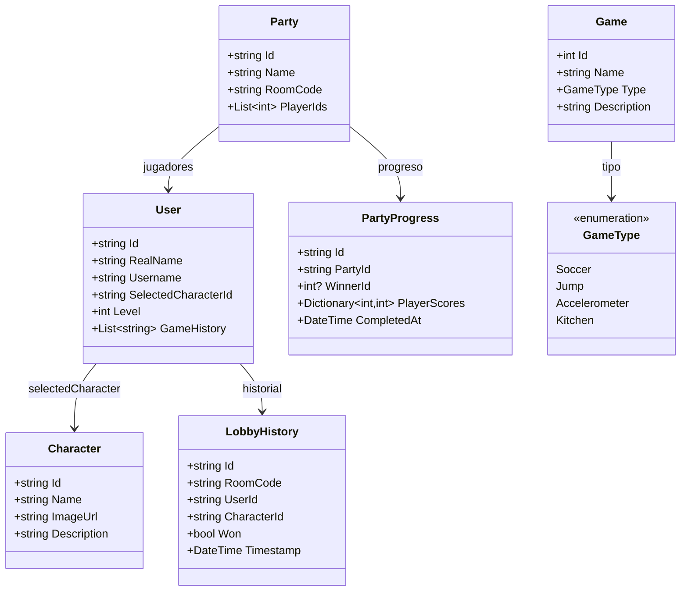

---

## 2. Diagrama Entidad-Relación (Firestore)

Representa las colecciones de Cloud Firestore y sus relaciones lógicas.

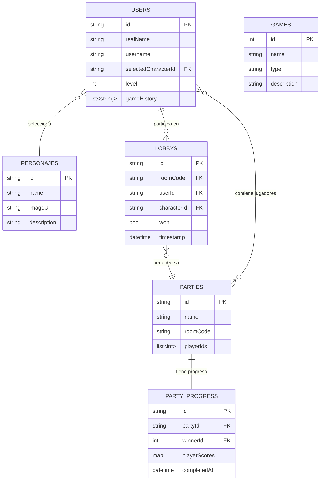

---

## 3. Diagrama de Flujo: Inicio de Sesión

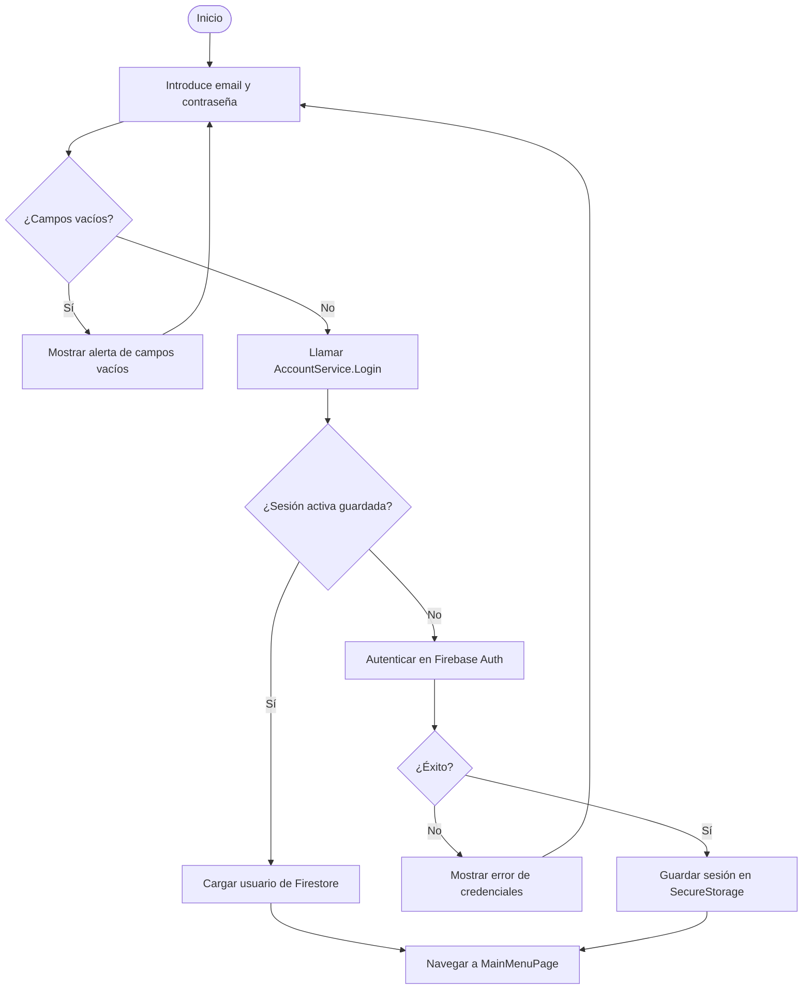

---

## 4. Diagrama de Flujo: Unirse a una Sala

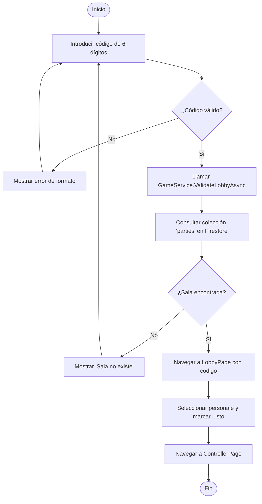

---

## 5. Diagrama de Secuencia: Flujo de Registro

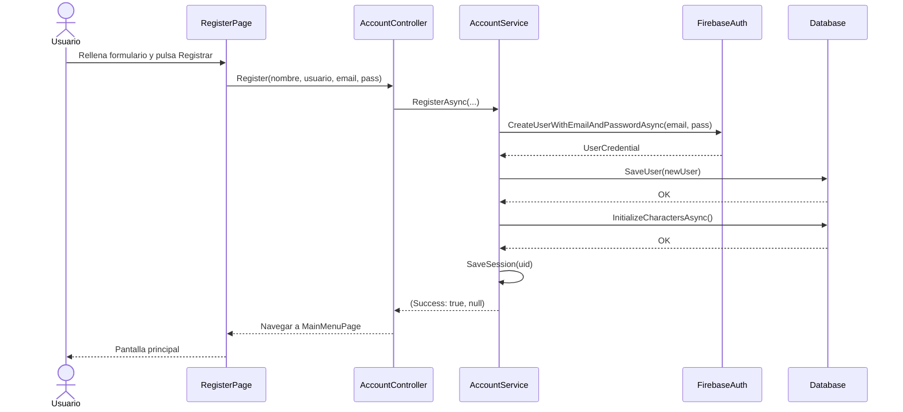

---

## 6. Diagrama de Secuencia: Flujo del Mando

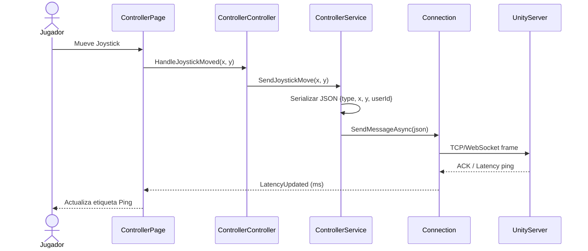

---

## 7. Resumen de Casos de Uso

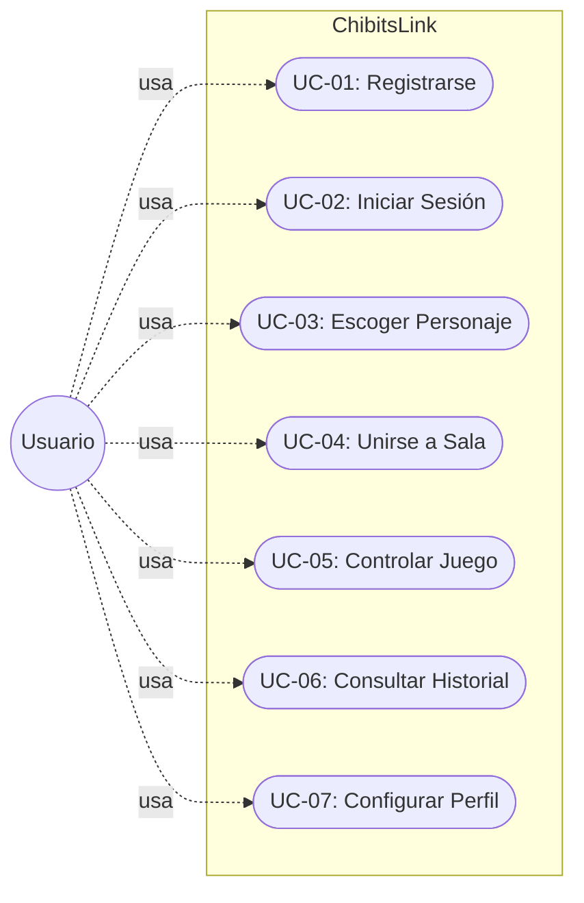

---

## UC-01: Registrarse

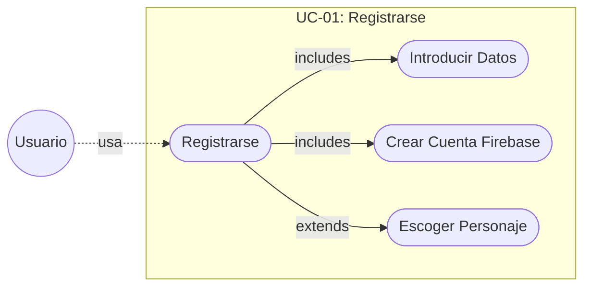

| | |
|---|---|
| **DESCRIPCIÓN**: El usuario crea una nueva cuenta en la plataforma. | |
| 1. Accede a RegisterPage | |
| 2. Introduce nombre real, nombre de usuario, email y contraseña | |
| 3. Confirma la contraseña | |
| 4. Pulsa Registrar | |
| 5. El sistema crea la cuenta en Firebase Auth | |
| 6. El sistema guarda el perfil en Firestore | |
| 7. Se inicia sesión automáticamente | |
| **PRECONDICIONES** | **POSTCONDICIONES** |
| El usuario no tiene cuenta | Cuenta creada en Firebase Auth |
| Conexión a internet activa | Perfil guardado en colección `users` |
| | Sesión activa durante 30 días |
| **DATOS ENTRADA** | **DATOS SALIDA** |
| Nombre real | Pantalla principal (MainMenuPage) |
| Nombre de usuario | |
| Email | |
| Contraseña | |
| **TABLAS** | **CLASES** |
| USERS | [RegisterPage.xaml.cs](file:///c:/Users/adris/RiderProjects/ChirbitsLink/ChibitsLink/src/main/cs/view/RegisterPage.xaml.cs) |
| | [AccountController.cs](file:///c:/Users/adris/RiderProjects/ChirbitsLink/ChibitsLink/src/main/cs/controller/AccountController.cs) |
| | [AccountService.cs](file:///c:/Users/adris/RiderProjects/ChirbitsLink/ChibitsLink/src/main/cs/service/AccountService.cs) |
| | [Database.cs](file:///c:/Users/adris/RiderProjects/ChirbitsLink/ChibitsLink/src/main/cs/repository/Database.cs) |

---

## UC-02: Iniciar Sesión

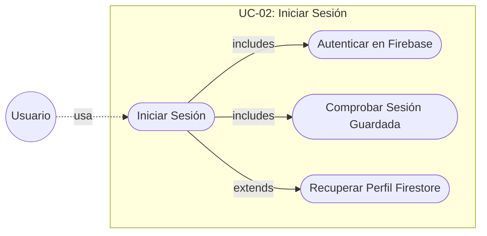

| | |
|---|---|
| **DESCRIPCIÓN**: El usuario accede a la aplicación con su cuenta. | |
| 1. Accede a LoginPage | |
| 2. El sistema comprueba si hay sesión guardada válida (30 días) | |
| 3. Si hay sesión, redirige directamente a MainMenuPage | |
| 4. Si no, el usuario introduce email y contraseña | |
| 5. Pulsa Iniciar Sesión | |
| 6. Firebase Auth valida las credenciales | |
| 7. Se carga el perfil desde Firestore | |
| 8. La sesión se guarda en SecureStorage | |
| **PRECONDICIONES** | **POSTCONDICIONES** |
| El usuario tiene cuenta registrada | Usuario autenticado en Firebase |
| Conexión a internet activa | Perfil cargado en memoria |
| | Sesión guardada durante 30 días |
| **DATOS ENTRADA** | **DATOS SALIDA** |
| Email | Pantalla principal (MainMenuPage) |
| Contraseña | Objeto `User` en memoria |
| **TABLAS** | **CLASES** |
| USERS | [LoginPage.xaml.cs](file:///c:/Users/adris/RiderProjects/ChirbitsLink/ChibitsLink/src/main/cs/view/LoginPage.xaml.cs) |
| | [AccountController.cs](file:///c:/Users/adris/RiderProjects/ChirbitsLink/ChibitsLink/src/main/cs/controller/AccountController.cs) |
| | [AccountService.cs](file:///c:/Users/adris/RiderProjects/ChirbitsLink/ChibitsLink/src/main/cs/service/AccountService.cs) |
| | [Database.cs](file:///c:/Users/adris/RiderProjects/ChirbitsLink/ChibitsLink/src/main/cs/repository/Database.cs) |

---

## UC-03: Escoger Personaje

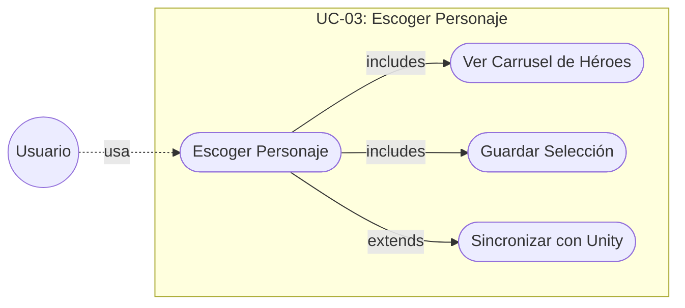

| | |
|---|---|
| **DESCRIPCIÓN**: El usuario elige el héroe con el que participará en la partida. | |
| 1. Accede a MainMenuPage o LobbyPage | |
| 2. El sistema carga los personajes desde Firestore | |
| 3. Se muestra el carrusel de personajes disponibles | |
| 4. El usuario selecciona un personaje | |
| 5. La UI actualiza el avatar y el nombre del héroe | |
| 6. El sistema guarda `SelectedCharacterId` en Firestore | |
| 7. (Opcional) Si hay conexión TCP activa, se sincroniza con Unity | |
| **PRECONDICIONES** | **POSTCONDICIONES** |
| Usuario logado | `SelectedCharacterId` actualizado en Firestore |
| Personajes inicializados en Firestore | Personaje visible en LobbyPage |
| **DATOS ENTRADA** | **DATOS SALIDA** |
| Selección del personaje (Id) | `User.SelectedCharacterId` actualizado |
| | Confirmación de héroe elegido |
| **TABLAS** | **CLASES** |
| USERS | [MainMenuPage.xaml.cs](file:///c:/Users/adris/RiderProjects/ChirbitsLink/ChibitsLink/src/main/cs/view/MainMenuPage.xaml.cs) |
| PERSONAJES | [LobbyPage.xaml.cs](file:///c:/Users/adris/RiderProjects/ChirbitsLink/ChibitsLink/src/main/cs/view/LobbyPage.xaml.cs) |
| | [AccountService.cs](file:///c:/Users/adris/RiderProjects/ChirbitsLink/ChibitsLink/src/main/cs/service/AccountService.cs) |
| | [Database.cs](file:///c:/Users/adris/RiderProjects/ChirbitsLink/ChibitsLink/src/main/cs/repository/Database.cs) |
| | [Connection.cs](file:///c:/Users/adris/RiderProjects/ChirbitsLink/ChibitsLink/src/main/cs/net/Connection.cs) |

---

## UC-04: Unirse a una Sala

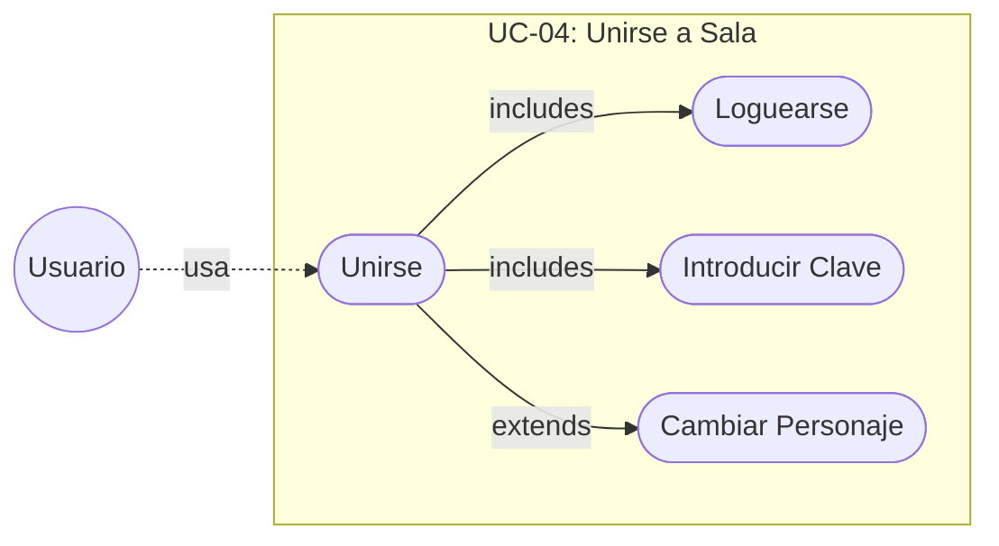

| | |
|---|---|
| **DESCRIPCIÓN**: El usuario se une a una sala de juego existente mediante un código de 6 dígitos. | |
| 1. Pincha Unirse desde JoinRoomPage o SelectionPage | |
| 2. Introduce la clave de 6 dígitos | |
| 3. Pulsa Conectar | |
| 4. El sistema valida la clave contra Firestore | |
| 5. La clave es correcta: navega a LobbyPage | |
| 6. (Opcional) Cambio de personaje desde el lobby | |
| **PRECONDICIONES** | **POSTCONDICIONES** |
| Usuario logado | Conexión a Lobby establecida |
| Sala creada en Unity | Aparición del jugador en la partida |
| | Acceso a ControllerPage (mando virtual) |
| **DATOS ENTRADA** | **DATOS SALIDA** |
| Clave de sala (6 dígitos) | LobbyPage activa |
| NickName de usuario | |
| **TABLAS** | **CLASES** |
| USERS | [JoinRoomPage.xaml.cs](file:///c:/Users/adris/RiderProjects/ChirbitsLink/ChibitsLink/src/main/cs/view/JoinRoomPage.xaml.cs) |
| PARTIES | [SelectionPage.xaml.cs](file:///c:/Users/adris/RiderProjects/ChirbitsLink/ChibitsLink/src/main/cs/view/SelectionPage.xaml.cs) |
| | [GameService.cs](file:///c:/Users/adris/RiderProjects/ChirbitsLink/ChibitsLink/src/main/cs/service/GameService.cs) |
| | [Database.cs](file:///c:/Users/adris/RiderProjects/ChirbitsLink/ChibitsLink/src/main/cs/repository/Database.cs) |
| | [Connection.cs](file:///c:/Users/adris/RiderProjects/ChirbitsLink/ChibitsLink/src/main/cs/net/Connection.cs) |

---

## UC-05: Controlar el Juego por Mando

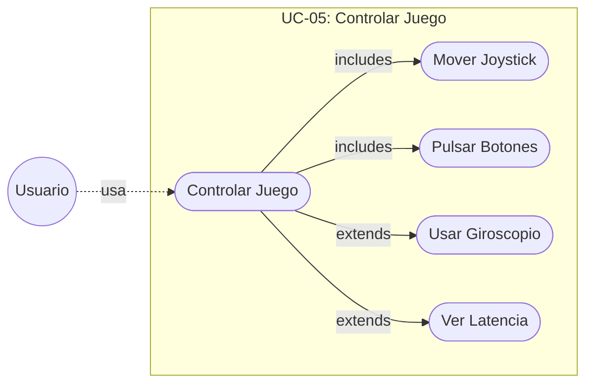

| | |
|---|---|
| **DESCRIPCIÓN**: El usuario controla su personaje en Unity desde el mando virtual del móvil. | |
| 1. El usuario está en ControllerPage con conexión activa | |
| 2. Mueve el joystick virtual (PanGesture) | |
| 3. El sistema serializa y envía las coordenadas al servidor | |
| 4. Pulsa botones de acción (A, B, X, Y) | |
| 5. (Opcional) Activa el modo giroscópico con el acelerómetro | |
| 6. El servidor Unity procesa los inputs y devuelve ACK/ping | |
| 7. La UI actualiza la etiqueta de latencia en ms | |
| **PRECONDICIONES** | **POSTCONDICIONES** |
| Usuario en LobbyPage listo | Inputs enviados al servidor Unity |
| Conexión TCP/WebSocket activa | Personaje controlado en tiempo real |
| **DATOS ENTRADA** | **DATOS SALIDA** |
| Posición joystick (x, y) | Evento de movimiento en Unity |
| Id de botón pulsado | Latencia actual (ms) |
| Lectura del acelerómetro | |
| **TABLAS** | **CLASES** |
| — | [ControllerPage.xaml.cs](file:///c:/Users/adris/RiderProjects/ChirbitsLink/ChibitsLink/src/main/cs/view/ControllerPage.xaml.cs) |
| | [ControllerController.cs](file:///c:/Users/adris/RiderProjects/ChirbitsLink/ChibitsLink/src/main/cs/controller/ControllerController.cs) |
| | [ControllerService.cs](file:///c:/Users/adris/RiderProjects/ChirbitsLink/ChibitsLink/src/main/cs/service/ControllerService.cs) |
| | [Connection.cs](file:///c:/Users/adris/RiderProjects/ChirbitsLink/ChibitsLink/src/main/cs/net/Connection.cs) |

---

## UC-06: Consultar Historial de Partidas

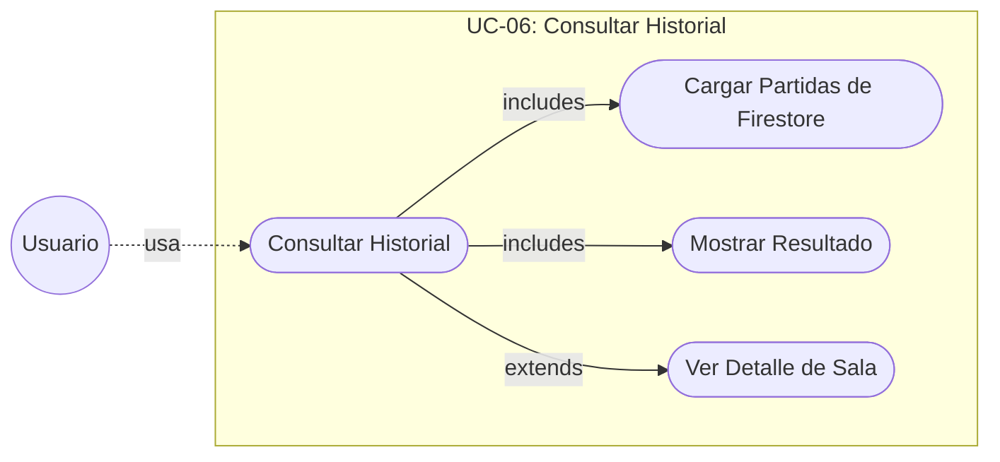

| | |
|---|---|
| **DESCRIPCIÓN**: El usuario consulta la lista de salas en las que ha participado y sus resultados. | |
| 1. Accede a HistoryPage desde el menú principal | |
| 2. El sistema comprueba la sesión activa | |
| 3. Consulta la colección `lobbys` filtrada por `UserId` | |
| 4. Ordena los registros por `Timestamp` descendente | |
| 5. Muestra la lista con código de sala y resultado (VICTORIA / DERROTA) | |
| **PRECONDICIONES** | **POSTCONDICIONES** |
| Usuario logado | Lista de partidas visible en HistoryPage |
| Al menos una partida jugada | |
| **DATOS ENTRADA** | **DATOS SALIDA** |
| Id del usuario activo | Lista de `LobbyHistory` |
| | Resultado por partida (VICTORIA/DERROTA) |
| **TABLAS** | **CLASES** |
| LOBBYS | [HistoryPage.xaml.cs](file:///c:/Users/adris/RiderProjects/ChirbitsLink/ChibitsLink/src/main/cs/view/HistoryPage.xaml.cs) |
| USERS | [AccountService.cs](file:///c:/Users/adris/RiderProjects/ChirbitsLink/ChibitsLink/src/main/cs/service/AccountService.cs) |
| | [Database.cs](file:///c:/Users/adris/RiderProjects/ChirbitsLink/ChibitsLink/src/main/cs/repository/Database.cs) |
| | [BooleanToTextConverter.cs](file:///c:/Users/adris/RiderProjects/ChirbitsLink/ChibitsLink/src/main/cs/converters/BooleanConverters.cs) |

---

## UC-07: Configurar Perfil

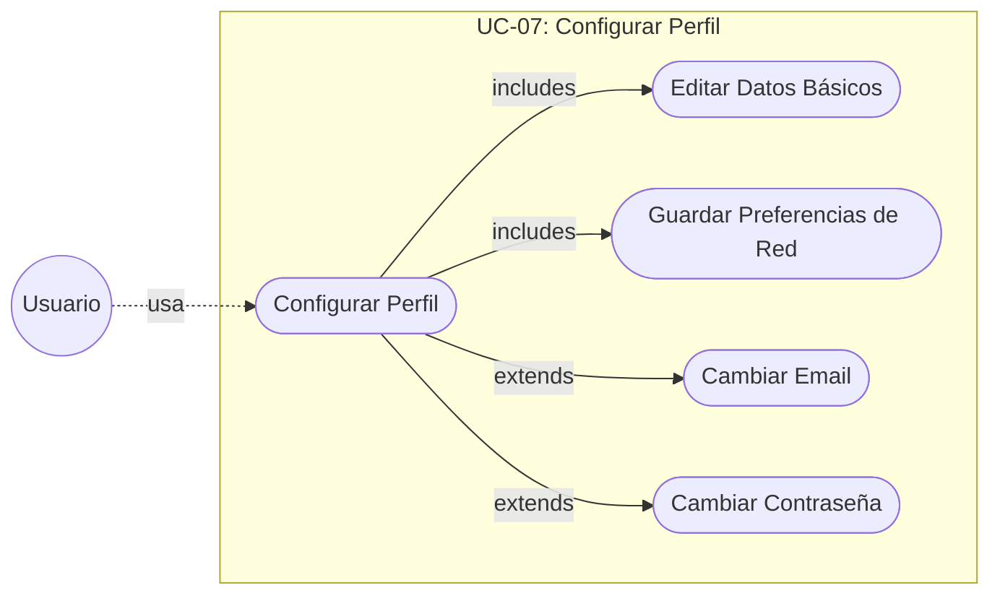

| | |
|---|---|
| **DESCRIPCIÓN**: El usuario actualiza su información de perfil y los parámetros de red del servidor. | |
| 1. Accede a SettingsPage | |
| 2. El sistema carga datos actuales del usuario y preferencias IP/puerto | |
| 3. El usuario edita nombre real, nombre de usuario, email o contraseña | |
| 4. (Opcional) Modifica IP y puerto del servidor Unity | |
| 5. Pulsa Guardar | |
| 6. El sistema actualiza el perfil en Firestore | |
| 7. (Opcional) Actualiza el email en Firebase Auth | |
| 8. (Opcional) Cambia la contraseña en Firebase Auth | |
| 9. Guarda preferencias de red en `Preferences` del dispositivo | |
| **PRECONDICIONES** | **POSTCONDICIONES** |
| Usuario logado | Datos de perfil actualizados en Firestore |
| | Email/contraseña actualizados en Firebase Auth |
| | Preferencias de red guardadas en dispositivo |
| **DATOS ENTRADA** | **DATOS SALIDA** |
| Nombre real (opcional) | Perfil actualizado |
| Nombre de usuario (opcional) | Cabecera del Shell actualizada |
| Nuevo email (opcional) | |
| Nueva contraseña (opcional) | |
| IP del servidor (opcional) | |
| Puerto del servidor (opcional) | |
| **TABLAS** | **CLASES** |
| USERS | [SettingsPage.xaml.cs](file:///c:/Users/adris/RiderProjects/ChirbitsLink/ChibitsLink/src/main/cs/view/SettingsPage.xaml.cs) |
| | [AccountService.cs](file:///c:/Users/adris/RiderProjects/ChirbitsLink/ChibitsLink/src/main/cs/service/AccountService.cs) |
| | [Database.cs](file:///c:/Users/adris/RiderProjects/ChirbitsLink/ChibitsLink/src/main/cs/repository/Database.cs) |