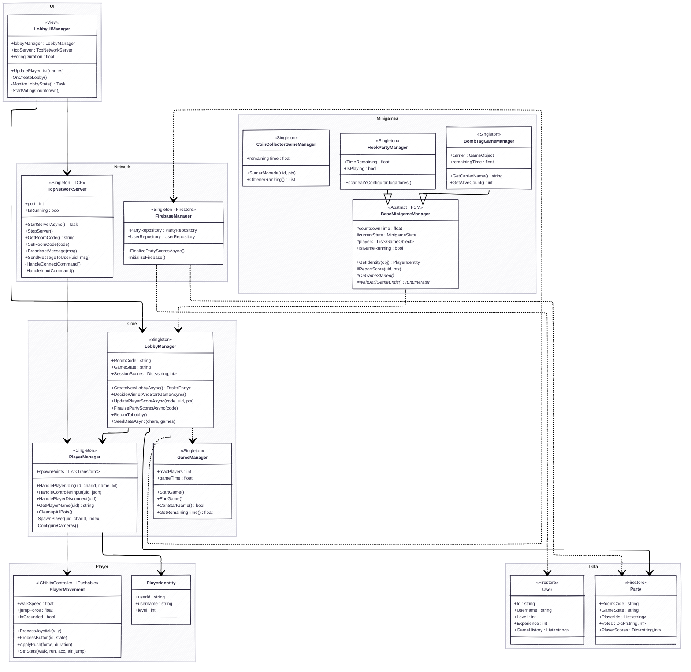
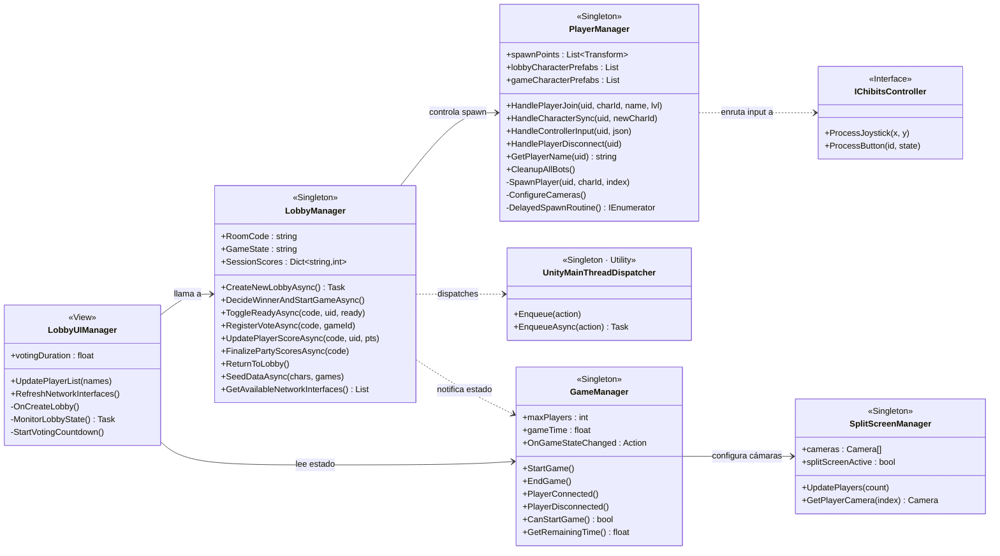
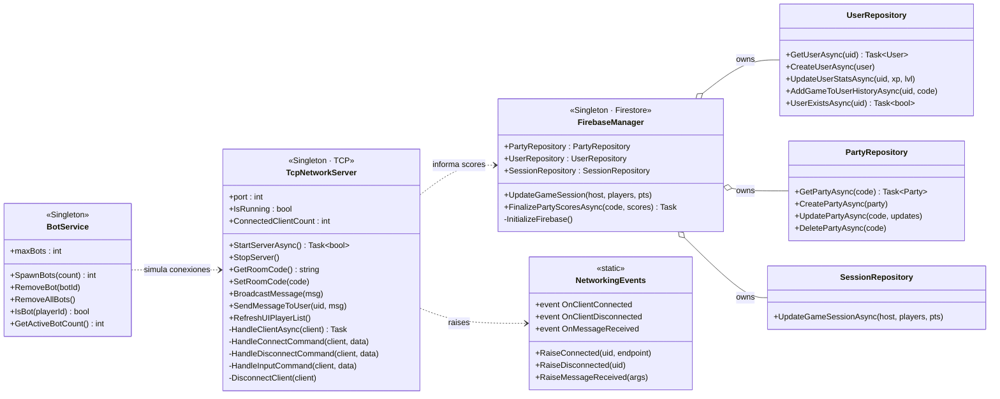
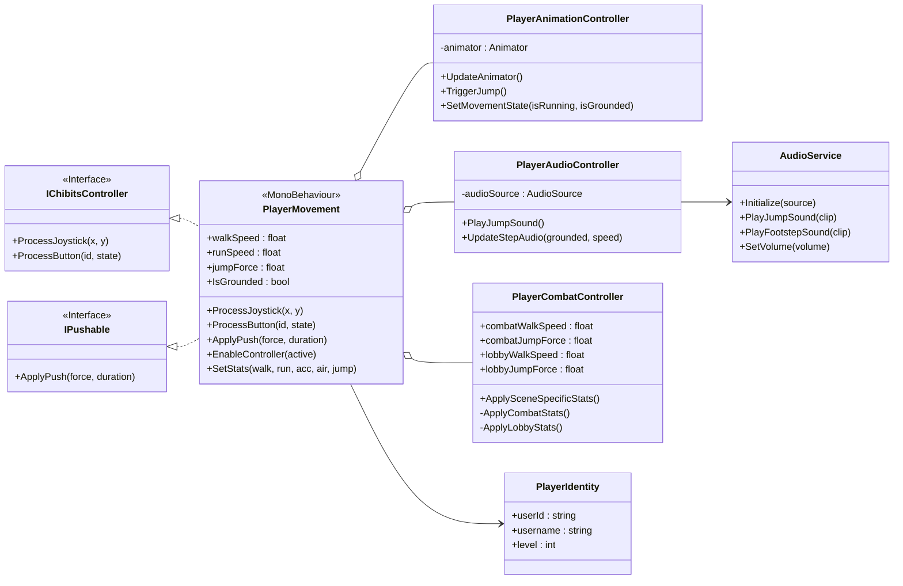
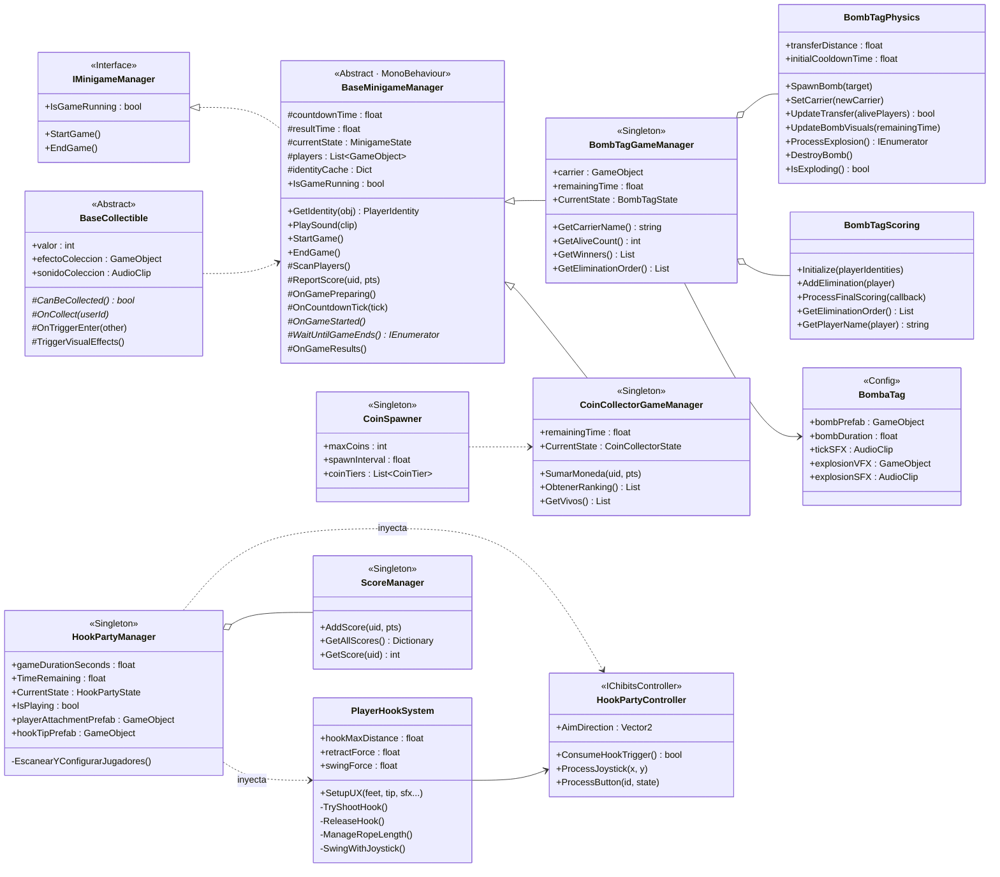
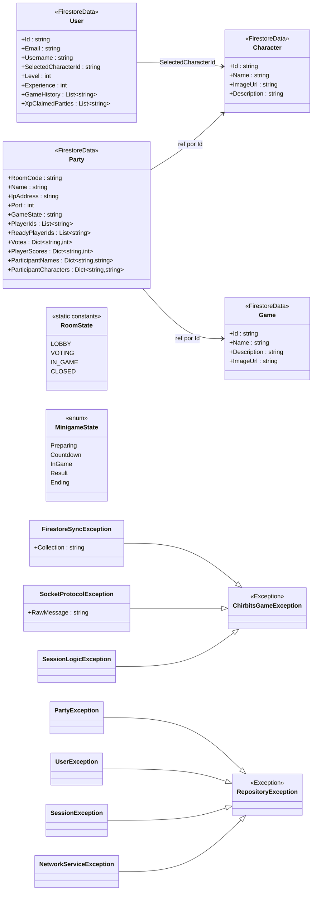

# Chirbits UNITY — Diagramas de Clases

> Empieza por la **Vista 0** (visión global) y luego consulta las vistas detalladas 1–5 por subsistema.

---

## Vista 0 — Visión Global

---

## Vista 1 — Core Managers

---

## Vista 2 — Red y Persistencia

---

## Vista 3 — Sistema de Jugador

---

## Vista 4 — Minijuegos

---

## Vista 5 — Modelos y Excepciones

